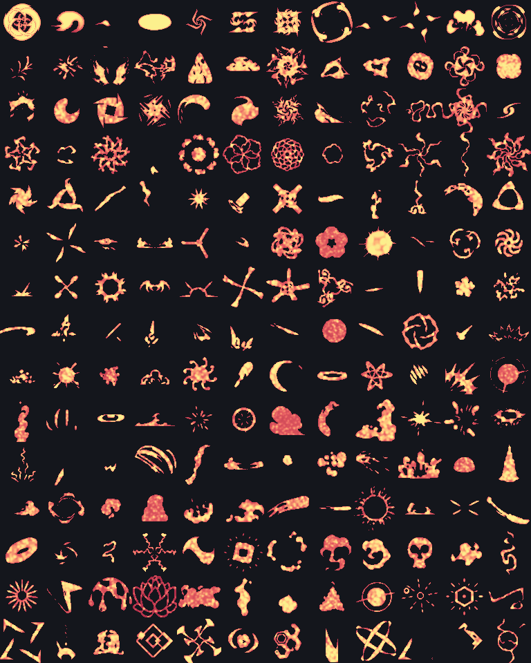
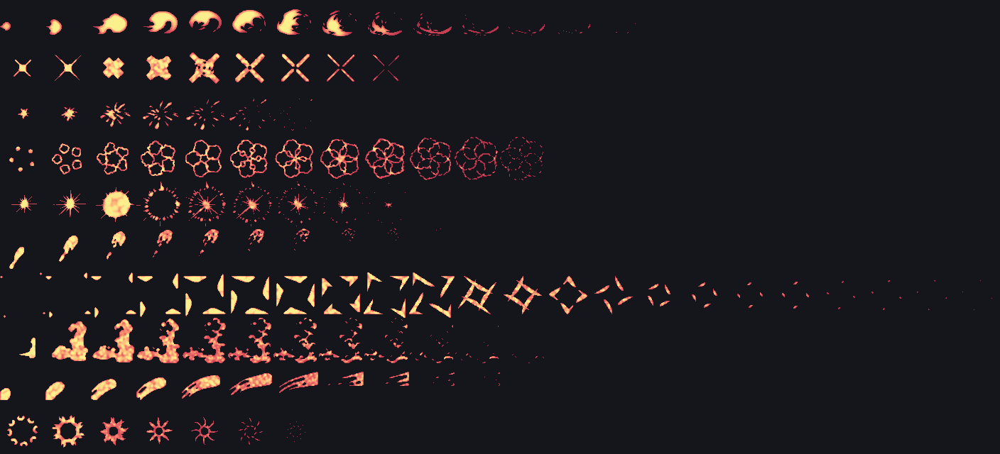
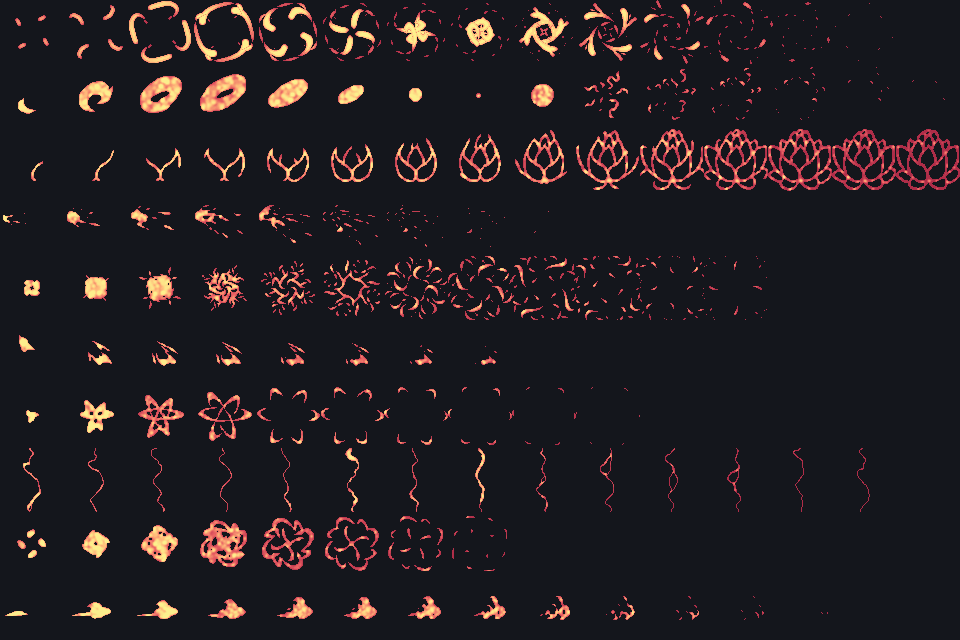
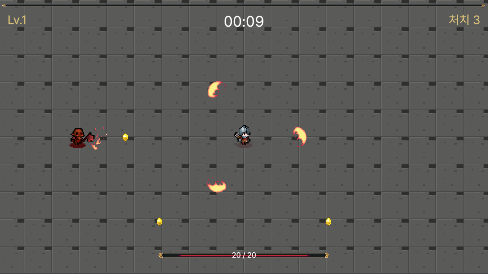
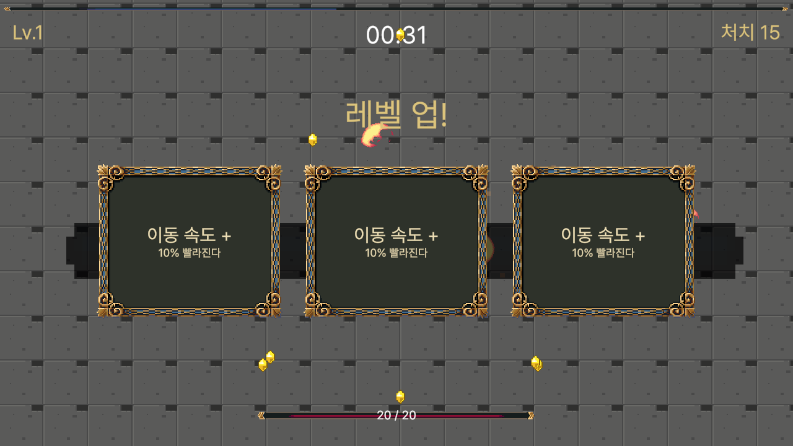
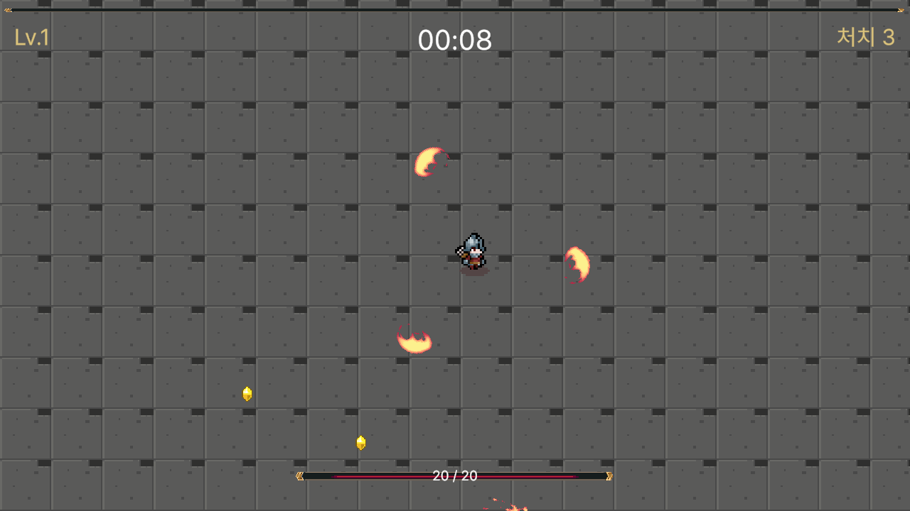

# Kenney CC0 에셋 후보 — 협동 웨이브 디펜스용

> [확정 게임 기획서](./확정-게임기획서.md)에 필요한 리소스를 Kenney 팩에서 추린 문서.
> 전부 **CC0(퍼블릭 도메인)** — 출처 표기 의무 없음, 상업 이용 가능, 학생 포트폴리오에 그대로 사용 가능.
>
> 🔴 **2026-09-04 — 이 문서 1~7절은 계획이고, 실제로 들어온 것은 Kenney 가 아니다.**
> itch.io 픽셀 팩 4종이 들어왔고 **그중 하나는 CC0 가 아니라 재배포 금지**다.
> 실물 확인 결과와 대응은 **[8절](#8--실제로-들어온-에셋--2026-09-04-확인)** 을 먼저 읽는다.
> 최종적으로 이 중 **필수 6팩만 골라 통합 `.unitypackage` 하나**를 만들어 1주차에 배포한다.

---

## ⚠️ 먼저 — 아트 스타일을 하나로 고정한다

Kenney 팩은 크게 **벡터/일러스트 계열**과 **픽셀 계열**로 나뉜다. **섞으면 게임이 조잡해 보인다.**
학생들이 "이거 왜 이렇게 안 예쁘죠"라고 느끼는 원인의 대부분이 스타일 혼용이다.

| 라인 | 구성 | 판단 |
|---|---|---|
| **A. 벡터/일러스트** | Top-down Shooter + Tower Defense (Top-Down) + UI Pack | ✅ **채택** — 필요한 게 다 있고 해상도가 커서 다루기 쉽다 |
| B. 픽셀 | Pixel Shmup 중심 | ❌ 16×16이라 탑다운 슈터용 소품이 부족. 픽셀은 임포트 설정 실수(블러)가 잦아 노베이스에 불리 |

> **결정: A 라인으로 통일. 픽셀 팩은 쓰지 않는다.**

---

## 1. 필수 팩 (통합 패키지에 포함)

| # | 팩 | 수량 | 쓰는 곳 |
|---|---|---|---|
| 1 | [Top-down Shooter](https://kenney.nl/assets/top-down-shooter) | 580 | **주력.** 플레이어, 적, 총알, 무기, 바닥 타일, 소품 |
| 2 | [Tower Defense (Top-Down)](https://kenney.nl/assets/tower-defense-top-down) | 300 | 아레나 바닥·장애물·구조물 보강 |
| 3 | [UI Pack](https://kenney.nl/assets/ui-pack) | 430 | 버튼, 패널, 슬라이더, 체력바, 업그레이드 카드 프레임 |
| 4 | [Particle Pack](https://kenney.nl/assets/particle-pack) | 80 | 피격·폭발·머즐 플래시 (512×512) |
| 5 | [Interface Sounds](https://kenney.nl/assets/interface-sounds) | — | 버튼 클릭, 업그레이드 선택, 웨이브 알림 |
| 6 | [Impact Sounds](https://kenney.nl/assets/impact-sounds) | — | 피격, 적 사망, 폭발 |

**이 6개면 게임이 완성된다.** 신규 제작 필요 0개.

---

## 2. 보조 팩 (필요하면 추가)

| 팩 | 쓸 곳 | 우선순위 |
|---|---|---|
| [Sci-fi Sounds](https://kenney.nl/assets/sci-fi-sounds) | 총 발사음 — Impact Sounds보다 사격에 잘 맞음 | 높음 |
| [Board Game Icons](https://kenney.nl/assets/board-game-icons) (250개) | **업그레이드 8종 아이콘** — 검·방패·심장·번개 등 | 높음 |
| [Music Jingles](https://kenney.nl/assets/music-jingles) | 웨이브 클리어 / 승리 / 패배 징글 | 중간 |
| [Minimap Pack](https://kenney.nl/assets/minimap-pack) | 적 위치 표시 마커 (⭐도전 과제용) | 낮음 |
| [Top-down Tanks Remastered](https://kenney.nl/assets/top-down-tanks-remastered) | 보스를 탱크로 만들 경우 | 낮음 |
| [Game Icons](https://kenney.nl/assets/game-icons) | 키보드·게임패드 프롬프트 (조작 안내 화면) | 낮음 |

> ⚠️ [Game Icons](https://kenney.nl/assets/game-icons)는 이름과 달리 **게임패드·키 프롬프트 아이콘**이다. 업그레이드 아이콘 용도로는 Board Game Icons를 쓸 것.

---

## 3. 게임 요소별 매핑

| 기획서 항목 | 어디서 가져오나 | 비고 |
|---|---|---|
| 플레이어 (2인) | Top-down Shooter — 캐릭터 스프라이트 1종 | **색만 바꿔 P1/P2** (`SpriteRenderer.color`) |
| 돌진형 적 | Top-down Shooter — 좀비/적 스프라이트 | |
| 원거리형 적 | Top-down Shooter — 총 든 적 | |
| 탱커형 적 | 위와 같은 스프라이트 **확대 + 색 변경** | 신규 에셋 불필요 |
| **보스** | 탱커형을 2배 확대 + 색 변경 | 또는 Top-down Tanks 사용 |
| 총알 3종 | Top-down Shooter — 탄환 스프라이트 | 색·크기로 구분 |
| 아레나 바닥 | Tower Defense (Top-Down) — 타일 | 타일 반복 배치 |
| 장애물 4~6개 | Top-down Shooter 소품 / TD 구조물 | 상자, 배럴, 벽 |
| 체력바 | UI Pack — 바 + 필 이미지 | |
| 업그레이드 카드 | UI Pack 패널 + Board Game Icons 아이콘 | |
| 타이틀·버튼 | UI Pack | |
| 피격·폭발 이펙트 | Particle Pack | |
| 발사음 | Sci-fi Sounds | |
| 피격·사망음 | Impact Sounds | |
| 버튼·업그레이드음 | Interface Sounds | |

---

## 4. ⚠️ Kenney로 해결 안 되는 것 2가지

### ① 한글 폰트

**Kenney Fonts에는 한글 글리프가 없다.** UI가 전부 한국어이므로 별도 폰트가 필요하다.

| 후보 | 라이선스 | 비고 |
|---|---|---|
| **Noto Sans KR** (Google Fonts) | OFL | 무난·안전. 기본값으로 권장 |
| 나눔고딕 / 나눔스퀘어 | 무료 (네이버) | 게임 느낌 살리기 좋음 |
| 눈누(noonnu.cc) 상업용 무료 폰트 | 폰트별 상이 | **폰트마다 조건이 다르니 반드시 개별 확인** |

> 📌 **강사가 폰트 1종을 정해 통합 패키지에 넣는다.** 학생이 각자 고르면 TMP 폰트 애셋 생성에서 시간이 통째로 날아간다.
> TMP 한글 폰트 애셋은 **글자 수가 많아 생성이 오래 걸린다.** 미리 만들어 배포할 것 (Phase 6 UI 회차 전에).

### ② 루프 BGM

Kenney의 [Music Jingles](https://kenney.nl/assets/music-jingles)는 **짧은 징글**이라 인게임 배경음악으로는 부족하다.

- **1안**: BGM 없이 진행 → SFX만으로도 게임은 성립한다. **가장 안전**
- **2안**: 외부 CC0/무료 음원 사이트에서 1곡만 골라 통합 패키지에 포함 (**강사가 라이선스 직접 확인**)
- **3안**: ⭐도전 과제로 학생이 각자 조달

> 노베이스 반에서 음악 찾기는 시간 블랙홀이다. **1안 또는 2안 권장.**

---

## 5. 통합 `.unitypackage` 제작 가이드 (강사 작업)

### 폴더 구조

```
Assets/
└── _GameAssets/
    ├── Sprites/
    │   ├── Characters/     플레이어, 적
    │   ├── Projectiles/    총알
    │   ├── Environment/    타일, 장애물
    │   └── UI/             버튼, 패널, 바, 아이콘
    ├── Audio/
    │   ├── SFX/
    │   └── UI/
    ├── Effects/            파티클 텍스처
    └── Fonts/              TMP 한글 폰트 애셋 (생성 완료본)
```

> `_GameAssets` 앞의 언더스코어는 Project 창 **맨 위에 고정**시키기 위함. 노베이스가 파일을 못 찾는 걸 줄인다.

### 임포트 설정 — 전원 동일하게

| 항목 | 값 | 이유 |
|---|---|---|
| Texture Type | Sprite (2D and UI) | |
| **Pixels Per Unit** | **100 통일** | ⚠️ 팩마다 다르면 캐릭터와 타일 크기가 안 맞는다 |
| Filter Mode | Bilinear | 벡터 계열이므로 |
| Compression | Normal Quality | |
| Sprite Mode | 스프라이트시트는 Multiple + Slice | 강사가 미리 잘라서 배포 |

> 🔑 **스프라이트시트 슬라이싱은 강사가 끝내서 배포한다.** Sprite Editor 사용법을 노베이스에게 가르치는 데 최소 1회차가 든다. 그 회차는 게임 만드는 데 쓰는 게 낫다.

### 배포 시 함께 줄 것

- `에셋_목록.md` — 어떤 파일이 뭔지 한 줄씩 (학생이 이름만 보고 못 찾는다)
- 라이선스 안내 1장 (아래 6번)

---

## 6. 라이선스 안내 (학생 배포용 문구)

> 이 수업에서 쓰는 그래픽·사운드는 **Kenney(kenney.nl)** 가 배포한 **CC0(퍼블릭 도메인)** 리소스입니다.
>
> - 출처를 표기하지 않아도 됩니다
> - 상업적으로 이용해도 됩니다
> - **여러분이 만든 게임을 포트폴리오로 쓰거나 스토어에 올려도 됩니다**
>
> 단, **한글 폰트는 CC0가 아닐 수 있습니다.** 수업에서 제공한 폰트를 다른 프로젝트에 쓸 때는 해당 폰트의 라이선스를 따로 확인하세요.

> 💡 CC0라는 점을 **학생에게 반드시 설명할 것.** "이거 그냥 써도 돼요?"는 매 기수 나오는 질문이고, "된다"는 답이 학생의 포트폴리오 의욕을 크게 올린다.

---

## 7. 다음 액션

1. 필수 6팩 다운로드 → 라인 A로 통일 확인
2. Board Game Icons에서 **업그레이드 8종 아이콘 선정**
3. 한글 폰트 1종 확정 + **TMP 폰트 애셋 미리 생성**
4. BGM 정책 결정 (1안/2안)
5. 폴더 구조대로 정리 + 스프라이트시트 슬라이싱
6. `.unitypackage` 익스포트 → `에셋_목록.md` 동봉 → 1주차 배포

---

## ⚠️ 현재 저장소 상태 (2026-09-02)

**위의 Kenney 팩은 아직 이 저장소에 들어와 있지 않다.** 배포용 통합 `.unitypackage` 도 아직 없다.

11주차(053·054)에 스프라이트와 Animator 를 다뤄야 해서, 그때까지 쓸 **강사용 임시 플레이스홀더**를
코드로 생성해 넣어 두었다.

| 파일 | 규격 | 용도 |
|---|---|---|
| `Sprites/Characters/Player_Walk.png` | 128×32 (32×32 × 4프레임) | 053 슬라이스 · 054 걷기 |
| `Sprites/Characters/Enemy_Walk.png` | 64×32 (32×32 × 2프레임) | 054 몬스터 걷기 |
| `Sprites/Environment/Obstacle.png` | 32×32 (단일) | 053 Sprite Mode Single · 055 장애물 |
| `Sprites/Environment/GroundTile.png` | 64×64 (단일) | 069 무한 맵 바닥 타일 |
| `Sprites/Characters/Enemy_Base.png` | 32×32 (단일, 회색) | 072 몬스터 3종 — 색만 바꿔 쓴다 |
| `Sprites/Weapons/Blade.png` | 16×32 (단일, 회색) | 076 회전 칼 |
| `Sprites/Weapons/Shot.png` | 8×8 (단일, 회색) | 079 총알 |
| `Sprites/Items/Gem.png` | 12×12 (단일, 회색) | 081 경험치 젬 |
| `Sprites/UI_Bar.png` | 8×8 (단일, 흰색) | 094 체력바·경험치바 |
| `Audio/Sfx_Hit.wav` | 0.08초 · 22050Hz · 모노 | 100 몬스터 피격음 |
| `Audio/Sfx_Die.wav` | 0.20초 | 100 몬스터 처치음 |
| `Audio/Sfx_Hurt.wav` | 0.25초 | 100 플레이어 피격음 |
| `Audio/Sfx_Click.wav` | 0.06초 | 100 버튼음 |

임포트 설정은 053회차에서 가르치는 값 그대로 넣어 두었다 — **PPU 32 · Filter Mode Point ·
Compression None**.

> 🔑 **이건 아트가 아니라 자리 표시다.** Kenney 팩이 들어오면 **파일만 교체**하면 된다.
> 프리팹·애니메이션 클립은 스프라이트를 참조만 하므로 구조는 그대로 간다.
> 다만 **PPU 는 반드시 32 로 통일**해서 임포트해야 크기가 어긋나지 않는다.
>
> ⚠️ **학생 배포용 통합 패키지는 별도 작업이 필요하다.** 기획서상 1주차 배포인데 아직 없다.

---

## 8. 🔴 실제로 들어온 에셋 — 2026-09-04 확인

> 위 1–7절은 **Kenney 팩을 쓴다는 계획**으로 쓴 문서다.
> 실제로 들어온 것은 **Kenney 가 아니라 itch.io 픽셀 팩 4종**이다. 아래가 실물 확인 결과다.

### 8.1 들어온 것

| 폴더 | 무엇 | PNG 수 | 규격 |
|---|---|---|---|
| `Effect and FX Pixel All Free/` | 이펙트 스프라이트시트 (Part 1~15) | **180** | **64×64 격자 · 9행 고정 · 열 5~23** |
| `Tiny RPG Character Asset Pack 01 …Soldier&Orc/` | Soldier · Orc | 34 | **100×100 격자** · 그림자 있음/없음 2종 |
| `Tiny RPG Character Asset Pack 02 …Demon_A&Blood Monster_A/` | Demon_A · Blood Monster_A | 28 | **100×100 격자** · 그림자 있음/없음 2종 |
| `DarkAgesUi_v1.0/` | UI 타일시트 (패널·바·버튼·구분선 25종) | 1 | 384×352 · **32×32 타일** |
| `Coin_Gems/` | 코인 회전 시트 8종 | 8 | 64×16 · 80×16 (**16×16 · 4~5프레임**) |
| `Dungeon_Tileset.png` | 던전 타일셋 | 1 | 512×640 (타일 크기 미실측, 32 추정) |

**이펙트 팩 구조** — 파일 하나가 시트 하나이고, **행이 색상 변형 9종, 열이 애니메이션 프레임**이다.
180개 전부 가로·세로가 64로 정확히 나뉘고 **행 수는 예외 없이 9**다.

```
Part 1/03.png  832×576  =  13열 × 9행     ← 13프레임 × 색상 9종
Part 15/700.png 1408×576 = 22열 × 9행
```

**캐릭터 팩 구조** — 4캐릭터 전부 같은 상태 집합을 갖는다. 우리 코드가 필요한 것과 정확히 맞는다.

| 파일 | 프레임 | 우리 쪽 쓰임 |
|---|---|---|
| `*_Idle.png` | 6 | 대기 |
| `*_Walk.png` | 8 | 이동 (067·112) |
| `*_Attack01/02(/03).png` | 6~9 | 공격 (076·119) |
| `*_Hurt.png` | 4 | **피격 번쩍임 (099·119)** |
| `*_Death.png` | 4 | **죽음 이펙트 (100·102)** |

### 8.2 ✅ 임포트 설정 — 고쳤다 (2026-09-04)

**고치기 전 — Sprites 폴더 텍스처 277개 중 260개가 임포트되면서 크기가 바뀌었다.**

```
Texture Type = Default   →   NPOT Scale = ToNearest   →   가장 가까운 2의 제곱수로 리사이즈

Part 15/700.png      1408×576  →  1024×512   🚨
Soldier_Walk.png      800×100  →  1024×128   🚨
32x32-Tilesheet.png   384×352  →   512×256   🚨
Dungeon_Tileset.png   512×640  →   512×512   🚨  아래 2타일 줄이 뭉개진다
```

> 🔴 **블러가 아니라 데이터 손실이다.** 64 격자·100 격자가 어긋나서 슬라이스가 아예 안 맞는다.
> `Texture Type` 을 `Sprite` 로 바꾸면 `NPOT Scale` 이 `None` 이 되고 원본 크기가 유지된다.
> 실제로 `Part 1/03.png` 는 `Sprite` 로 되어 있어서 832×576 그대로다.

**기존 프로젝트 스프라이트와 설정이 다르다.**

| | 기존 (쓰고 있는 것) | 새로 들어온 것 |
|---|---|---|
| Texture Type | `Sprite` | 🚨 `Default` |
| Filter Mode | `Point` | 🚨 `Bilinear` — 픽셀아트가 흐려진다 |
| Compression | (Uncompressed) | 🚨 `Compressed` — 픽셀 경계가 깨진다 |
| Mip Maps | off | 🚨 on |
| PPU | 32 | 100 |

**고쳐야 하는 것 — 팩마다 PPU 가 다르다**

| 폴더 | Texture Type | Filter | Compression | **PPU** | Sprite Mode |
|---|---|---|---|---|---|
| `Effect and FX …` | Sprite | Point | None | **64** | Multiple · 64×64 Grid |
| `Tiny RPG … 01 / 02` | Sprite | Point | None | **25** ⭐ | Multiple · 100×100 Grid |
| `DarkAgesUi_v1.0` | Sprite | Point | None | **32** | Multiple · 32×32 Grid |
| `Coin_Gems` | Sprite | Point | None | **16** | Multiple · 16×16 Grid |
| `Dungeon_Tileset.png` | Sprite | Point | None | 32 (추정) | Multiple · Grid |

> 🔑 **PPU 를 하나로 통일하면 안 된다.** 격자 크기를 PPU 로 넣으면 **1타일 = 1월드유닛**이 되어
> 기존 32px 스프라이트(PPU 32)와 크기가 자동으로 맞는다.
>
> ⭐ **단, Tiny RPG 만 격자(100)가 아니라 25 다.** 이유는 8.2-b 에 있다 —
> 100×100 칸에 그림이 20px 뿐이라 격자를 PPU 로 넣으면 화면에서 1/4 로 보인다.

**실행 결과** — [`docs/05_Unity프로젝트/에셋-임포트-일괄수정.cs.txt`](../05_Unity프로젝트/에셋-임포트-일괄수정.cs.txt)

```
바꾼 것       = 268개
격자로 자름   = 68개 파일 · 1203조각

=== 검증 (텍스처 285개) ===
크기가 바뀐 것   = 0      ← 260개였다
Point 아닌 것    = 0
Sprite 아닌 것   = 0
압축된 것        = 0
원본 크기 유지   = 277개

Dungeon_Tileset.png   512x640 → 512x640   Multiple  PPU 32   조각 320  (16×20)
32x32-Tilesheet.png   384x352 → 384x352   Multiple  PPU 32   조각 132  (12×11)
Soldier_Walk.png      800x100 → 800x100   Multiple  PPU 100  조각 8
Demon_A_Attack01.png  700x100 → 700x100   Multiple  PPU 100  조각 7
spr_coin_ama.png       64x16  →  64x16    Multiple  PPU 16   조각 4
Part 15/700.png      1408x576 → 1408x576  Single    PPU 64   (1024x512 였다)

Sprites 폴더 전체 스프라이트 = 1718개
```

> 🔴 **FX 팩 180장은 일부러 슬라이스하지 않았다.**
> 전부 자르면 9색 × 프레임 = **약 19,000 조각**이 되어 `.meta` 가 폭발한다.
> 색상 행 9개 중 실제로 쓰는 건 **1행뿐**이라 9배가 낭비다.
> 쓸 이펙트를 고른 뒤 그 파일만 `Slice → Grid By Cell Size → 64×64` 한다.

> 💡 `.aseprite` 원본 8개(캐릭터 4종 × 2)도 같이 들어와 있다. Unity 2D Aseprite Importer 가 따로 처리하며
> `TextureImporter` 대상이 아니다. **색·모양을 직접 고칠 수 있는 원본**이라 지우지 않는다.

### 8.2-b ✅ 캐릭터 크기 — A안 적용 (PPU 100 → 25)

임포트를 고친 뒤에도 **보이는 크기가 안 맞았다.** 칸 안에서 그림이 실제로 차지하는 픽셀을 재보고 원인을 찾았다.

| | 칸 | 실제 그림 | 칸을 채운 비율 | 월드 높이 |
|---|---|---|---|---|
| Soldier | 100×100 | **17×21** | 21% | **0.21** |
| Orc | 100×100 | 22×15 | 15% | 0.15 |
| Demon_A | 100×100 | 20×20 | 20% | 0.20 |
| Blood Monster_A | 100×100 | 20×15 | 15% | 0.15 |
| 기존 Player | 32×32 | 20×26 | 81% | **0.81** |
| 기존 Enemy | 32×32 | 25×26 | 81% | 0.81 |
| 코인 | 16×16 | 10×15 | 94% | 0.94 |

> 🔑 **Tiny RPG 팩은 20px 짜리 그림을 100×100 캔버스에 그려놨다.**
> `1칸 = 1월드유닛` 은 맞는데, 칸의 79%가 빈 공간이라 화면에서는 기존 스프라이트의 **약 1/4** 로 보인다.

**세 가지 안을 놓고 A 를 골랐다** — 스케일·카메라·콜라이더를 하나도 안 건드린다.

| 안 | 무엇 | 결과 | |
|---|---|---|---|
| **A** | Tiny RPG PPU **100 → 25** | 21px ÷ 25 = **0.84** — 기존 0.81 과 맞는다 | ✅ **채택** |
| B | PPU 100 유지 | 카메라 `orthographicSize` 5 → 약 1.2. 타일·UI 전부 다시 맞춰야 한다 | |
| C | 기존 placeholder 를 새 아트 기준으로 교체 | 콜라이더·속도 재조정 필요 | |

**적용 결과 (실측)**

```
PPU 25 로 바꾼 것 = 62개   건너뜀 = 8개 (.aseprite 원본)

Soldier_Walk_000           PPU 25   칸 4.00   그림 0.84   기존 대비 1.03배
Demon_A_Walk_000           PPU 25   칸 4.00   그림 0.80   기존 대비 0.98배
Orc_Walk_000               PPU 25   칸 4.00   그림 0.60   기존 대비 0.74배
Blood Monster_A_Walk_000   PPU 25   칸 4.00   그림 0.60   기존 대비 0.74배

다른 팩은 그대로 : FX 64 · DarkAgesUi 32 · Coin 16 · Dungeon 32 · 기존 32
```

> 💡 **Orc 와 Blood Monster 가 0.74배인 건 정상이다.** 둘은 걷기 프레임의 그림이 15px 로
> 낮고 대신 가로가 넓다(22×15, 20×15). 키가 아니라 **체형 차이**다.

> ⚠️ **한 칸은 4월드유닛이 됐다** (100 ÷ 25). 그림이 칸의 21% 뿐이라 화면에는 영향이 없지만,
> `Collider2D` 를 스프라이트 크기로 자동 맞추면 4배로 잡힌다. **콜라이더는 손으로 준다.**

### 8.3 🔴 라이선스 — 1절의 "전부 CC0" 는 이제 사실이 아니다

| 팩 | 라이선스 파일 | 확인된 내용 |
|---|---|---|
| `DarkAgesUi_v1.0` | ✅ `LICENSE.txt` 포함 | **CC0 아니다.** 상업·개인 이용과 수정은 허용, **재배포·다른 팩에 포함 금지** |
| `Effect and FX Pixel All Free` | ❌ 없다 | **미확인** |
| `Tiny RPG … 01 / 02` | ❌ 없다 | **미확인** |
| `Coin_Gems` · `Dungeon_Tileset.png` | ❌ 없다 | **미확인** |

`DarkAgesUi_v1.0/LICENSE.txt` (Hypnobius, hypnobius.itch.io) 중 걸리는 조항:

```
You are not allowed to:
- Resell or redistribute this asset pack, either modified or in its original form
- Include these tiles in other downloadable packs
```

> ✅ **2026-09-04 결정 — 수업용으로만 쓴다. 유통하지 않는다.**
> 그래서 아래 조항은 문제가 되지 않는다. 다만 **전제가 "재배포 안 함"** 이라는 걸 기록해 둔다.
>
> | 해도 되는 것 | 하면 안 되는 것 |
> |---|---|
> | 수업에서 쓰기 · 학생이 자기 게임에 쓰기 | 에셋 팩 자체를 다시 배포하기 |
> | 수정해서 쓰기 | 통합 `.unitypackage` 에 넣어 나눠주기 |
> | 학생이 만든 게임을 itch.io 에 올리기 | 에셋 원본을 `Snapshot` zip 에 넣기 |
>
> 🔑 **학생 배포 방식**: 에셋은 **각자 itch.io 에서 직접 내려받게** 하고 폴더 배치만 안내한다.
> 게임 빌드에 포함되는 건 문제없다 — 금지된 건 "에셋 팩의 재배포" 이지 "게임에 쓰는 것" 이 아니다.

> ⚠️ **참고 — 원래 문서 계획과 충돌하던 지점**
>
> | 계획 | 문제 |
> |---|---|
> | 7절 "배포용 통합 `.unitypackage`" | **다른 팩에 포함 금지**에 걸린다 |
> | `Snapshot_*` zip 배포 (Phase 0~10 전체) | 에셋 원본이 들어가면 **재배포**에 해당할 수 있다 |
>
> **→ 1안으로 간다** (각자 내려받기). 2·3안은 필요 없어졌다.
>
> 🔴 **다만 6절의 "전부 CC0" 문구는 여전히 사실이 아니다.**
> **127회차 개인 미션 ②의 답**과 **Phase 10 위험 신호**를 "각 팩 라이선스를 따른다 · 게임에 써서 올리는 건 된다" 로 고친다.
> 학생에게 "이거 그냥 올려도 돼요?" 의 답은 **여전히 "된다"** 다 — 금지된 건 에셋 팩 재배포뿐이다.

> ⚠️ **나머지 4종의 라이선스는 미실측이다.** 팩 안에 파일이 없어서 확인할 수 없었다.
> 내려받은 itch.io 페이지에서 조건을 확인하고 이 표를 채운다.

### 8.4 다음에 할 일

- [x] 임포트 설정 일괄 수정 (팩별 PPU) — 268개 수정, 리사이즈 260 → **0**
- [x] 캐릭터·타일·UI·코인 슬라이스 — 68개 파일 1203조각
- [x] **캐릭터 크기 결정** — A안(PPU 25) 적용. 62개 수정, 기존 대비 0.74~1.03배
- [ ] FX 팩은 쓸 이펙트를 고른 뒤 그 파일만 64×64 슬라이스
- [x] **배포 방식 결정** — 수업용 한정, 에셋은 학생이 각자 내려받는다 (통합 패키지 안 만든다)
- [ ] 나머지 4종 라이선스는 여전히 미확인 — 유통할 일이 생기면 그때 확인한다
- [ ] 6절 · 127회차 · Phase 10 의 "CC0" 표현 수정
- [x] **캐릭터 배정** — Soldier = 주인공, Orc · Demon_A · Blood Monster_A = 적 (10절)
- [x] **FX 20종 선별·슬라이스** — 회차 매핑은 9.2 (2079조각)
- [x] **그림자 있는 버전으로 확정** · 프리팹 11개 + 씬 + HUD 교체 완료 (11절)
- [ ] 프리팹 교체 시 `Collider2D` 크기 손으로 지정 (칸이 4월드유닛이라 자동 맞춤 금지)

---

## 9. FX 팩 카탈로그 — 2026-09-04 확인

> 180장을 전부 열어보는 대신 **각 시트의 가장 화려한 프레임을 64px 로 뽑아 한 장에 모았다.**
> 
> **행 = Part 1~15, 열 = 그 Part 안의 파일 12개(번호순).** 아래 표로 파일명을 찾는다.

| 행 | Part | 파일 (열 1 → 12) |
|---|---|---|
| 1 | Part 1 | 03 04 05 06 13 14 15 16 23 24 25 26 |
| 2 | Part 2 | 62 63 64 65 69 70 71 72 76 77 78 79 |
| 3 | Part 3 | 113 114 115 116 123 124 125 126 133 134 135 136 |
| 4 | Part 4 | 174 175 176 177 184 185 186 187 194 195 196 197 |
| 5 | Part 5 | 220 221 222 223 230 231 232 233 240 241 242 243 |
| 6 | Part 6 | 273 274 275 276 283 284 285 286 293 294 295 296 |
| 7 | Part 7 | 313 314 315 316 323 324 325 326 333 334 335 336 |
| 8 | Part 8 | 375 376 377 378 385 386 387 388 395 396 397 398 |
| 9 | Part 9 | 426 427 428 429 436 437 438 439 446 447 448 449 |
| 10 | Part 10 | 464 465 466 467 474 475 476 477 484 485 486 487 |
| 11 | Part 11 | 506 507 508 509 516 517 518 519 526 527 528 529 |
| 12 | Part 12 | 566 567 568 569 576 577 578 579 586 587 588 589 |
| 13 | Part 13 | 612 613 614 615 622 623 624 625 632 633 634 635 |
| 14 | Part 14 | 652 653 654 655 662 663 664 665 672 673 674 675 |
| 15 | Part 15 | 700 701 702 703 710 711 712 713 720 721 722 723 |

### 9.1 색상 행 — 시트마다 순서가 같다

시트 3개(`Part 1/04`, `Part 4/185`, `Part 15/700`)에서 행별 평균 색을 재봤다. **순서가 일치한다.**

| 행 | 색 | Part 1/04 | Part 4/185 | Part 15/700 |
|---|---|---|---|---|
| 0 (맨 위) | 주황 | `#E99E72` | `#DA655F` | `#F4AD77` |
| 1 | 보라 | `#B157DB` | `#7322CC` | `#C862E7` |
| 2 | 하늘 | `#7CBEE8` | `#2E8AD6` | `#89D5F0` |
| 3 | 초록 | `#74B85C` | `#388D48` | `#80C960` |
| 4 | 갈색 | `#B78761` | `#8C563F` | `#C59163` |
| 5 | 회색 | `#AAAAAA` | `#6F6F6F` | `#B9B9B9` |
| 6 | 자주 | `#916B6D` | `#6E4967` | `#9F7371` |
| 7 | 빨강 | `#AD5A50` | `#6E1D3F` | `#C45B52` |
| 8 | 남색 | `#4B4389` | `#4B2271` | `#514894` |

> 🔑 **업그레이드 8종에 같은 이펙트의 다른 색을 주면 된다.** 색을 코드로 안 바꿔도 된다.

**조각 이름 규칙** — 자를 때 위 → 아래, 왼쪽 → 오른쪽으로 번호를 매겼다.

```
색상 행 k 의 프레임 f  =  {파일}_{ (k * 프레임수 + f) 를 세 자리로 }

예) Part 1/04 는 14프레임이다
    주황 = 04_000 ~ 04_013
    보라 = 04_014 ~ 04_027
    하늘 = 04_028 ~ 04_041   …
```

### 9.2 골라서 자른 20종 — 회차 매핑

프레임을 전부 펴서 눈으로 확인한 것만 넣었다.



| 파일 | 프레임 | 무엇 | 쓸 곳 |
|---|---|---|---|
| `Part 1/04` | 14 | 초승달 베기 | **076 근접 칼 휘두르기** |
| `Part 1/16` | 14 | 초승달이 원형으로 회전 | **076 `MeleeRing` 회전 칼날** |
| `Part 5/232` | 9 | X 십자 베기 | 강공격 · 크리티컬 |
| `Part 8/385` | 8 | 빠른 사선 슬래시 | 연타 · 빠른 공격 업그레이드 |
| `Part 12/578` | 11 | 가로로 뻗는 베기 | **086 관통탄** |
| `Part 2/63` | 7 | 작은 사방 흩뿌림 | **078 총알 임팩트 · 099 피격** |
| `Part 4/185` | 12 | 꽃 모양 폭발 | **100 몬스터 죽음 · 090 보스** |
| `Part 3/125` | 12 | 가시가 사방으로 | **086 폭발탄** |
| `Part 9/446` | 10 | 별꽃이 회전하며 확산 | 크리티컬 · 별 스킬 |
| `Part 6/293` | 9 | 섬광 → 원형 확산 | **085 레벨업** |
| `Part 7/315` | 7 | 톱니 태양이 커진다 | 오라 · 버프 |
| `Part 13/612` | 15 | 도넛 링 커졌다 사라짐 | **082 자석 범위 · 122 부활** |
| `Part 14/655` | 15 | 연꽃이 아래에서 피어오름 | 힐 · 회복 |
| `Part 6/285` | 8 | 구름이 피어남 | 독 · 장판 |
| `Part 4/196` | 14 | 세로 번개 줄기 | **번개 업그레이드** |
| `Part 10/484` | 12 | 불기둥이 솟음 | **화염 업그레이드** |
| `Part 9/437` | 10 | 불꽃 꼬리 | 투사체 트레일 |
| `Part 11/526` | 9 | 불덩이 + 꼬리 (가로) | **078 투사체 본체** |
| `Part 12/566` | 13 | 화염 투사체 (가로) | 투사체 변형 |
| `Part 15/700` | 22 | 회전 표창 확산 | 광역기 · 회전 참격 |

```
자른 파일 = 20개   조각 = 2079개  (20종 × 프레임 × 색상 9행)
```

> 🔴 **나머지 160장은 일부러 안 잘랐다.** 전부 자르면 약 19,000 조각이라 `.meta` 가 폭발한다.
> 더 필요하면 위 카탈로그에서 고른 뒤 그 파일만 `Slice → Grid By Cell Size → 64×64` 한다.

> ⚠️ **처음 붙인 이름 두 개가 틀렸다.** 썸네일만 보고 판단해서다.
> `Part 15/700` 은 "Z 번개" 가 아니라 **회전 표창**이고, `Part 9/437` 은 "타원 링" 이 아니라 **불꽃 꼬리**다.
> 프레임을 전부 펴 보고 고쳤다. **위 표는 전부 펴서 확인한 것이다.**

---

## 10. 캐릭터 배정 — 확정

| 역할 | 캐릭터 | 폴더 | 비고 |
|---|---|---|---|
| **주인공** | **Soldier** | `Tiny RPG … 01/Characters(100x100 split)/Soldier/` | 그림 21px · 기존 Player 대비 1.03배 |
| 적 ① | **Orc** | `Tiny RPG … 01/…/Orc/` | 15px · 0.74배 (체형이 낮고 넓다) |
| 적 ② | **Demon_A** | `Tiny RPG … 02/…/Demon_A/` | 20px · 0.98배 |
| 적 ③ | **Blood Monster_A** | `Tiny RPG … 02/…/Blood Monster_A/` | 15px · 0.74배 |

**폴더가 두 벌씩 있다** — `Soldier/` 와 `Soldier with shadows/`.
✅ **`with shadows` 로 확정** (2026-09-04). 바닥에 붙어 보여서 위에서 내려다보는 시점에 맞는다. 교체 결과는 11절.

**상태별 파일** (네 캐릭터 공통)

| 파일 | 프레임 | 우리 쪽 |
|---|---|---|
| `*_Idle` | 6 | 대기 |
| `*_Walk` | 8 | 이동 (067 · 112) |
| `*_Attack01` / `02` (Soldier 는 `03`도) | 6~9 | 공격 (076 · 119) |
| `*_Hurt` | 4 | 피격 (099 · 119) |
| `*_Death` | 4 | 죽음 (100 · 102) |

> 🔑 **`Enemy` 3종의 스프라이트만 바꾸면 된다.** `ChargerEnemy`/`RunnerEnemy`/`TankEnemy` 는
> 이미 클래스가 나뉘어 있어서(071~073) 프리팹의 `SpriteRenderer` 만 갈아끼우면 된다.

> ⚠️ **콜라이더는 손으로 준다.** 칸이 4월드유닛(100 ÷ PPU 25)이라 스프라이트 크기로 자동 맞추면 4배가 된다.

---

## 11. 리소스 교체 완료 — 2026-09-04

> **그림자 있는 버전으로 확정.** `Soldier with shadows/` 처럼 `with shadows` 폴더를 쓴다.
> 바닥에 붙어 보여서 위에서 내려다보는 시점에 맞는다.




### 11.1 프리팹 11개

| 프리팹 | 전 | 후 |
|---|---|---|
| `Enemy_Charger` | `Enemy_Base` | **Orc** |
| `Enemy_Runner` | `Enemy_Base` | **Demon_A** |
| `Enemy_Tank` | `Enemy_Base` | **Blood Monster_A** |
| `Enemy` · `Chaser` | `Enemy_Walk_0` | Orc |
| `Enemy_Boss1/2/3` | `Enemy_Base` | Demon_A · Blood Monster_A · Orc |
| `ExpGem` | `Gem` | **코인** `spr_coin_ama_000` |
| `Projectile` | `Shot` | **불덩이** `526_004` (FX) |
| `Blade` | `Blade` | **초승달 베기** `04_005` (FX) |
| 씬 `Player` | `Player_Walk_0` | **Soldier** |

> 🔑 **콜라이더는 하나도 안 건드렸다.** 새 아트의 그림 높이가 0.84 유닛이라 기존 `Circle r=0.45`(지름 0.9)와 맞는다.

### 11.2 맵 — 던전 돌바닥

`InfiniteGround` 구조(타일 9장이 플레이어를 따라 순환)는 그대로 두고 **스프라이트와 타일링만** 바꿨다.

| | 전 | 후 |
|---|---|---|
| 스프라이트 | `GroundTile` (단색) | **`Dungeon_Tileset_181`** (돌바닥) |
| `localScale` | `(10, 10)` | **`(1, 1)`** |
| `SpriteRenderer.size` | `(2, 2)` | **`(20, 20)`** |
| 화면에 보이는 타일 | 10유닛짜리 4장 | **1유닛짜리 400장** |

> 🚨 **`scale 10` + `size 2` 는 타일 하나가 10유닛으로 늘어난다.** 도트가 10배로 뭉개져 보였다.
> `scale 1` + `size 20` 으로 바꿔야 스프라이트가 원래 크기(1유닛)로 반복된다. 같은 20×20 영역인데 결과가 다르다.

**타일 고르기** — 320조각 중 불투명한 145개를 놓고 ① 좌우·상하 가장자리 차이 ② 무늬 편차를 재서 골랐다.

| 후보 | 이음매 | 무늬편차 | 판정 |
|---|---|---|---|
| `Dungeon_Tileset_188` | 0.00 | 3.77 | 갈색 흙. 이음매는 완벽한데 **던전 느낌이 안 났다** |
| **`Dungeon_Tileset_181`** | 90.69 | 9.31 | **회색 돌바닥. 이음매 점수는 나쁘지만 그게 타일 경계라 오히려 맞다** ✅ |
| `Dungeon_Tileset_166` | 0.00 | 0.67 | 완전 단색 |

> 🔑 **이음매 점수가 낮다고 좋은 게 아니다.** 돌바닥은 타일 경계가 그림에 있어서 점수가 나쁘게 나온다.
> 반복하면 그 경계가 바닥 격자가 된다 — 던전에는 그게 맞다. **숫자만 보고 188을 골랐다가 눈으로 보고 바꿨다.**

### 11.3 UI — DarkAgesUi

**타일시트를 위젯 단위로 다시 잘랐다.** 32격자 132조각은 패널 하나를 9조각으로 쪼개서 9-slice 를 못 쓴다.

```
132조각 (32격자)  →  22조각 (위젯)
Panel_Gold(96x96, border 28) · Panel_Parchment · Bar_Gold/Dark/Blue(96x32, border 26/8)
Line_Red/Blue/Green · Btn_Navy/Olive/Dark/Gray · Icon_Diamond/X/Warn …
```

| HUD 요소 | 전 | 후 |
|---|---|---|
| `HealthBar` | `UI_Bar` 흰 사각 | **`Bar_Gold`** Sliced · 460×44 |
| `HealthBar/Fill` | `UI_Bar` | **`Line_Red`** Filled |
| `ExpBar` | `UI_Bar` | **`Bar_Gold`** Sliced · 높이 28 |
| `ExpBar/Fill` | `UI_Bar` | **`Line_Blue`** Filled |
| `LevelUpPanel/Card_0~2` | `UI_Bar` 회색 | **`Panel_Gold`** Sliced (금테 장식) |
| `PausePanel/Btn_Resume` | `UI_Bar` 파랑 | **`Bar_Gold`** Sliced |
| `PausePanel/Btn_Title` | `UI_Bar` 회색 | **`Bar_Dark`** Sliced |
| 모서리 글자 · 제목 | 흰색 | **Honey Gold `#DCC47C`** |

**9-slice 배율** — `Image.pixelsPerUnitMultiplier` 를 안 맞추면 테두리가 3배로 커진다.

```
화면 테두리 두께 = 원본 테두리 x (referencePixelsPerUnit / (스프라이트 PPU x multiplier))
                 = 26 x (100 / (32 x mult))

mult = 100/32 = 3.125  → 원본 1px = 화면 1px   (얇은 바에 쓴다)
mult = 100/64 = 1.5625 → 원본 1px = 화면 2px   (패널 · 버튼에 쓴다)
```

기본값 `mult = 1` 이면 26px 테두리가 화면에서 81px 이 된다. **높이 30 짜리 바가 깨진다.**

### 11.4 겪은 것

**① `TextureImporter.spritesheet` 로 쓰면 Unity 6 에서 무시된다**

이미 조각이 있는 파일은 Sprite Editor 데이터 프로바이더가 값을 갖고 있어서 `SaveAndReimport` 때 되돌아간다.
22조각을 썼는데 다시 읽으니 **132조각 그대로**였다. `ISpriteEditorDataProvider` 로 써야 한다.

```csharp
var factory = new SpriteDataProviderFactories(); factory.Init();
var provider = factory.GetSpriteEditorDataProviderFromObject(importer);
provider.InitSpriteEditorDataProvider();
provider.SetSpriteRects(rects);
provider.GetDataProvider<ISpriteNameFileIdDataProvider>()
        .SetNameFileIdPairs(rects.Select(r => new SpriteNameFileIdPair(r.name, r.spriteID)));
provider.Apply();
importer.SaveAndReimport();
```

> 💡 조각이 **하나도 없던** 파일(캐릭터·던전·코인)은 `.spritesheet` 로도 됐다. 이미 있던 파일만 문제였다.

**② `GameObject.Find` 는 꺼진 오브젝트를 못 찾는다**

`LevelUpPanel` · `PausePanel` 은 평소 꺼져 있어서 자식까지 전부 "없음" 으로 나왔다.
`Transform` 을 직접 훑는 함수로 바꿨다.

**③ 코인이 플레이어보다 컸다**

```
코인   PPU 16  그림 15px → 0.94 유닛
플레이어              21px → 0.84 유닛
```

PPU 를 **16 → 48** 로. `15 / 48 = 0.31 유닛`(플레이어의 37%). **스케일·콜라이더는 안 건드렸다** —
줍는 범위(`Circle r=0.28`)를 그대로 두려고 PPU 쪽을 바꿨다.

**④ 어둡게 처리에 선 그림을 쓰면 안 된다**

레벨업 배경을 `Line_Blue` 로 바꿨더니 화면이 안 덮이고 **가운데 가로 띠**만 생겼다.
단색 채우기에는 `UI_Bar`(8×8 흰 사각)가 맞다. 색만 `#08080F` 알파 235 로 준다.

### 11.5 남은 것

- [ ] **애니메이션** — 지금은 `_Walk_000` 한 장만 쓴다. Idle/Walk/Attack/Hurt/Death 를 `Animator` 로 연결
- [ ] 몬스터가 **좌우를 안 본다** — 이동 방향에 따라 `flipX`
- [ ] 죽음 이펙트를 FX `185`(꽃 폭발)로 교체
- [ ] 피격 시 FX `63`(작은 흩뿌림) 띄우기
- [ ] 벽·장식 타일로 맵에 변화 주기 (지금은 바닥만)

---

## 12. 애니메이션 — 2026-09-04



### 12.1 Animator 를 안 썼다

`Animator` 컨트롤러 대신 **배열을 순서대로 넘기는 스크립트** 하나를 만들었다.
[`Scripts/Effect/SpriteAnimator.cs`](../../Assets/_Project/Scripts/Effect/SpriteAnimator.cs)

| | Animator 컨트롤러 | `SpriteAnimator` |
|---|---|---|
| 만들 것 | 클립 20개 + 컨트롤러 4개 | **스크립트 1개** |
| 이 과정에서 배우나 | **안 배운다** | 배열·타이머만 쓴다 |
| 학생이 읽을 수 있나 | 어렵다 | **80줄, 다 읽힌다** |

> 🔑 **커리큘럼에 `Animator` 회차가 없다.** 안 배운 도구로 프로젝트를 채우면
> 학생이 자기 게임을 못 고친다. 배열 + `Time.deltaTime` 은 이미 배운 것뿐이다(051 코루틴·016 배열).

```csharp
timer += Time.deltaTime;
float step = 1f / fps;
while (timer >= step) { timer -= step; frame = (frame + 1) % current.Length; sprite.sprite = current[frame]; }
```

### 12.2 붙인 것

| 대상 | 캐릭터 | fps | idle / walk / hurt |
|---|---|---|---|
| 씬 `Player` | Soldier | 10 | 6 / 8 / 4 |
| `Enemy_Charger` | Orc | 10 | 6 / 8 / 4 |
| `Enemy_Runner` | Demon_A | **12** (빠르다) | 6 / 8 / 4 |
| `Enemy_Tank` | Blood Monster_A | **7** (느리다) | 6 / 8 / 4 |
| `Enemy` · `Chaser` | Orc | 10 | 〃 |
| `Enemy_Boss1/2/3` | Demon_A · Blood · Orc | 8 / 6 / 8 | 〃 |

**상태 전환은 속도로 정한다.** `Rigidbody2D.linearVelocity.magnitude > 0.05` 면 걷기, 아니면 서기.
피격은 `Enemy.TakeDamage` 에서 `anim.PlayHurt()` 한 줄로 부른다. 끝나면 알아서 돌아온다.

> 🔑 **색과 좌우 뒤집기는 안 건드린다.** 색은 `Enemy.Flash()` 가, `flipX` 는 `Enemy.Move()` 가
> 이미 쓰고 있다. `SpriteAnimator` 는 `sprite.sprite` 만 바꾼다 — 서로 안 밟게 나눠 뒀다.

> ⚠️ **`OnEnable` 에서 초기화한다.** 풀에서 꺼낼 때마다 처음 프레임부터 시작해야 한다(102회차 규칙).

### 12.3 같이 고친 것 — `EnemyData.color`

`ApplyData()` 가 `sprite.color = data.color` 로 스프라이트를 물들이고 있었다.
placeholder 가 흰 도형일 때는 색 구분용이었지만, **진짜 아트를 덮는다.**

```
Enemy_Charger  #F24C4C → #FFFFFF     Boss_1  #FF7326 → #FFFFFF
Enemy_Runner   #FFD933 → #FFFFFF     Boss_2  #59D9FF → #FFFFFF
Enemy_Tank     #9E6BFF → #FFFFFF     Boss_3  #D940D9 → #FFFFFF
```

`Flash()` 가 번쩍인 뒤 `data.color` 로 되돌리므로 흰색이어야 원래 아트로 돌아온다.
**`data.scale` 은 그대로 뒀다** — 몬스터 크기 차이(탱커 1.5배, 보스 3~4배)는 아직 유효하다.

### 12.4 실측

```
[걷기]  58.43초 Soldier_Walk_000 → 58.50초 Soldier_Walk_001 → 58.58초 Soldier_Walk_002
[서기]  속도 0.00 → Soldier_Idle_003 → Soldier_Idle_001
[피격]  Orc_Hurt_003 · Orc_Hurt_001 → (2초 뒤) Orc_Walk_005
[색]    #FFFFFF     [flipX] True (Enemy.Move 가 그대로 담당)

콘솔 예외 0 · 컴파일 에러 0 · 씬 저장 후 isDirty = False
```

> ⚠️ **키보드 입력으로 걷는 건 미실측이다.** 레거시 Input Manager 라 시뮬레이션이 안 된다.
> 이동 스크립트를 끄고 `linearVelocity` 를 직접 넣어서 걷기 전환을 확인했다.

### 12.5 겪은 것

**① Play 모드가 멈춰 있었다**

`Time.time` 이 41.90 에 고정돼 프레임이 안 넘어가는 줄 알았다. 에디터가 백그라운드면
Play 가 스로틀된다. `timeScale` 은 1 이었다. 포커스를 준 뒤 다시 재니 정상이었다.

**② `LevelUpView` 는 패널이 아니라 HUD 루트에 붙어 있다**

레벨업 창을 닫으려고 `FindFirstObjectByType<LevelUpView>().gameObject.SetActive(false)` 를 했더니
**HUD 전체가 사라졌다.** 컴포넌트가 `HUD` 오브젝트에 붙어 있어서다.
Play 모드 중 변경이라 Stop 하니 원복됐다(`HUD 활성 = True`, `isDirty = False`). **씬에는 영향 없다.**

### 12.6 남은 것

- [ ] 공격 애니메이션 (`*_Attack01/02`) — 지금은 칼이 회전만 한다
- [ ] 죽음 애니메이션 (`*_Death`) — `Die()` 가 바로 풀에 반납해서 재생할 틈이 없다.
      넣으려면 반납을 늦춰야 하는데 `AliveCount` 와 얽혀 위험하다. 지금은 `DeathEffect` 로 대신한다
- [ ] 플레이어 피격 애니메이션 — `PlayerHealth` 쪽에 훅이 없다
- [ ] 벽·장식 타일로 맵에 변화 주기
